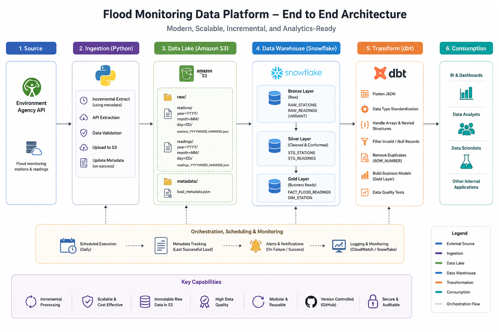

# 🌊 AECOM Flood Monitoring Data Engineering Pipeline

An end-to-end **ELT Data Engineering Pipeline** built using **Python, AWS S3, Snowflake and dbt** to ingest, process and transform real-time flood monitoring data from the **Environment Agency Flood Monitoring API**.

The pipeline follows modern cloud data engineering best practices by implementing a **Bronze → Silver → Gold** architecture, metadata-driven incremental loading, automated data quality validation and modular SQL transformations.

---

# 🏗️ Solution Architecture

> Replace the image below with your architecture diagram.



---

# 📌 Project Overview

This project was developed as part of the **AECOM Data Engineering Technical Assessment**.

The objective was to:

- Extract one week's worth of flood monitoring data
- Store raw JSON files in Amazon S3
- Load the raw data into Snowflake
- Transform semi-structured JSON using dbt
- Produce an analytics-ready dataset
- Support incremental data ingestion
- Build a scalable and reusable ELT pipeline

---

# 🚀 Technology Stack

| Layer | Technology |
|---------|------------|
| Programming Language | Python |
| API | Environment Agency Flood Monitoring API |
| Cloud Storage | Amazon S3 |
| Data Warehouse | Snowflake |
| Data Transformation | dbt |
| Version Control | Git & GitHub |

---

# 🏛️ Architecture Flow

```
Environment Agency API
        │
        ▼
Python Extraction Pipeline
(API + Incremental Metadata)
        │
        ▼
Amazon S3 Data Lake
(Raw JSON Files)
        │
        ▼
Snowflake Bronze Layer
(Raw JSON stored as VARIANT)
        │
        ▼
dbt Silver Layer
• Flatten JSON
• Data Cleaning
• Data Type Conversion
• Null Filtering
• Duplicate Removal
        │
        ▼
dbt Gold Layer
Business Ready Dataset
        │
        ▼
Analysts / Data Scientists
```

---

# 📂 Project Structure

```
AECOM/

│

├── extractor/
│   ├── api_client.py
│   ├── config.py
│   ├── metadata.py
│   ├── s3_upload.py
│   └── main.py
│
├── snowflake/
│   ├── Database Scripts
│   ├── Stages
│   ├── File Formats
│   └── COPY Commands
│
├── flood_monitoring_dbt/
│   ├── models/
│   │      ├── staging/
│   │      └── marts/
│   ├── dbt_project.yml
│   └── schema.yml
│
├── diagrams/
│      architecture.png
│
├── README.md
├── requirements.txt
└── .env.example
```

---

# 🔄 Pipeline Workflow

### Step 1

Extract flood monitoring stations and readings from the Environment Agency API.

↓

### Step 2

Store immutable JSON files in Amazon S3 using partitioned folders.

↓

### Step 3

Load raw JSON into Snowflake Bronze tables.

↓

### Step 4

Execute dbt Silver models to:

- Flatten nested JSON
- Convert data types
- Standardise array values
- Filter invalid records
- Remove duplicate readings

↓

### Step 5

Create Gold analytical tables by joining station metadata with water level readings.

↓

### Step 6

Run dbt data quality tests.

---

# 📥 Incremental Loading

The pipeline supports **incremental ingestion** using a metadata-driven approach.

The pipeline stores the timestamp of the last successful execution inside Amazon S3.

For every execution it:

- Reads the metadata file
- Determines the last successful load
- Extracts only new data
- Writes timestamped JSON files
- Loads new files into Snowflake
- Executes dbt models
- Updates metadata after successful completion

This approach ensures the pipeline is **idempotent** while avoiding unnecessary full reloads.

---

# 🥉 Bronze Layer

Raw API responses are stored without modification.

Features

- Raw JSON
- VARIANT datatype
- Immutable storage
- Replay capability
- Full audit history

---

# 🥈 Silver Layer

The Silver layer standardises and cleans the raw data.

Transformations include:

- JSON Flattening
- Data Type Conversion
- Array Handling
- Null Filtering
- Duplicate Removal
- Business Key Generation

---

# 🥇 Gold Layer

The Gold model joins stations and readings to produce an analytics-ready dataset.

Columns include:

- Station Reference
- Station Name
- River Name
- Catchment
- Town
- Latitude
- Longitude
- Reading Time
- Water Level

---

# ✅ Data Quality

Implemented using **dbt Tests**

Current validation includes:

- NOT NULL validation
- Duplicate detection
- Business key validation

Additional pipeline validation includes:

- API response validation
- S3 upload verification
- Snowflake COPY validation

---

# 📈 Scalability

The architecture is designed for future growth.

Possible enhancements include:

- Apache Airflow orchestration
- Snowpipe auto-ingestion
- Multi-cluster Snowflake warehouses
- CI/CD using GitHub Actions
- Monitoring & Alerting
- Great Expectations
- Data Freshness Testing

---

# ▶️ How to Run

## Clone Repository

```bash
git clone https://github.com/<YOUR_USERNAME>/aecom-flood-monitoring-pipeline.git
```

---

## Install Dependencies

```bash
pip install -r requirements.txt
```

---

## Configure Environment Variables

Create:

```
.env
```

using

```
.env.example
```

---

## Execute Pipeline

```bash
python extractor/main.py
```

---

## Execute dbt Models

```bash
dbt run
```

---

## Run Data Quality Tests

```bash
dbt test
```

---

# 📷 Sample Output

You can optionally add screenshots here:

- Amazon S3 Folder Structure
- Snowflake Bronze Table
- Snowflake Gold Table
- dbt Run
- dbt Test Results

---

# 🔮 Future Improvements

- Snowpipe Streaming
- Apache Airflow
- Terraform Infrastructure
- Docker Containerisation
- Kubernetes Deployment
- CI/CD Pipelines
- Data Observability
- Slack Alerts
- CloudWatch Monitoring

---

# 👨‍💻 Author

**Giritharan**

MSc Data Science

University of Roehampton

---

# 📄 License

This project was created for the **AECOM Data Engineering Technical Assessment**.
